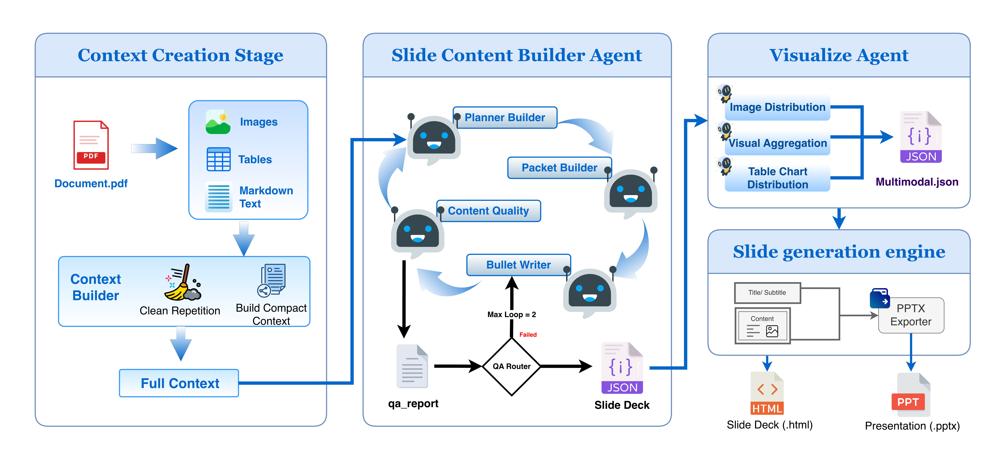
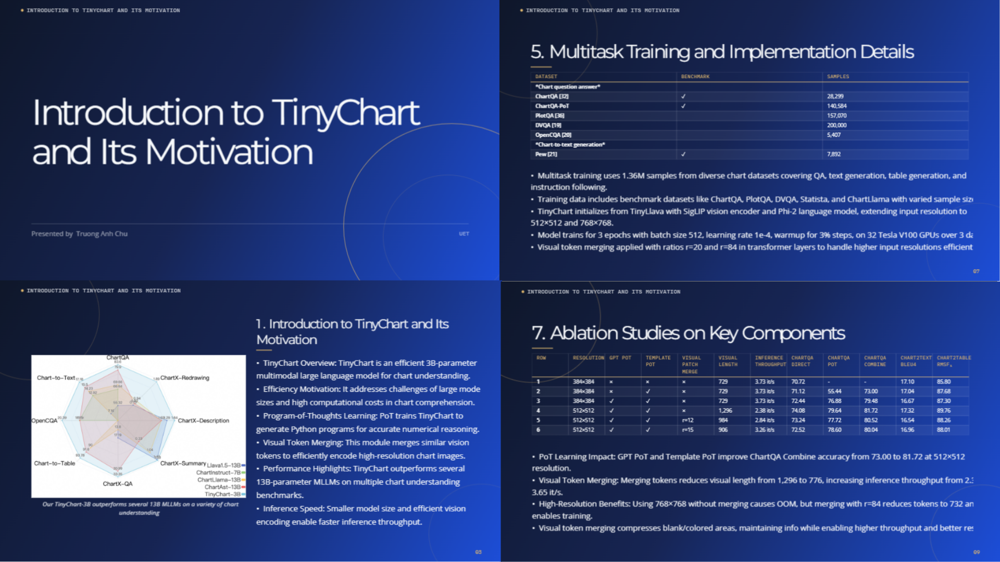
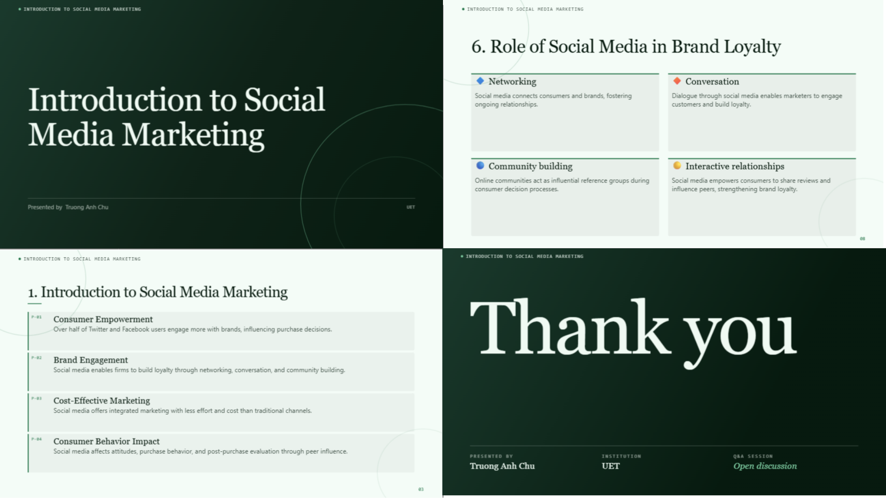
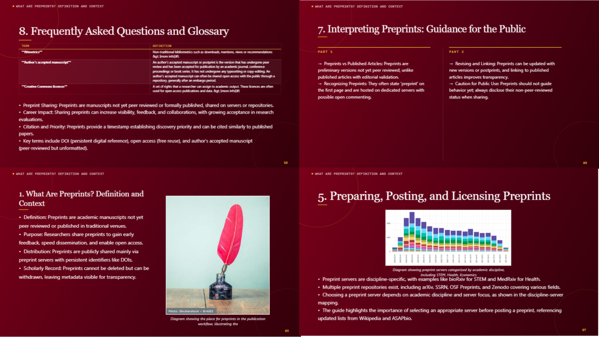

# MASG: Efficient Multi-Agent Slide Generation using Compact Language Models

[](https://opensource.org/licenses/MIT)
[](https://www.python.org/downloads/)
[](https://github.com/langchain-ai/langgraph)

Official repository for **MASG** (*Multi-Agent Slide Generation*), a template-free, end-to-end multi-agent framework designed to transform dense, multi-page PDF documents into structured, pedagogically sound, and visually appealing presentation slides.

---

## 🌟 Framework Architecture

MASG implements a stateful cooperative agent graph using **LangGraph**, orchestrating four specialized agents over a shared state memory:

<p align="center">
  
  <br>
  <i>Figure 1: End-to-end MASG workflow: Document Parsing, Cooperative Multi-Agent Drafting Graph with QA Feedback Loop, Multimodal Asset Distribution, and Dual Exporter Engine.</i>
</p>

### Key Architectural Components

1. **Document Parsing Stage**: Combines spatial layout bounding-box mapping with VLM-guided Table Structure Recognition (TSR) to extract text, tables, images, and LaTeX formulas from raw PDFs.
2. **Four-Agent Collaborative Drafting Graph**:
   - **Plan Builder Agent ($f_{\text{build}}$)**: Designs the overall presentation outline and slide specifications.
   - **Packet Builder Agent ($f_{\text{pack}}$)**: Performs strict page-level evidence grounding by creating retrievable source evidence packets for each slide.
   - **Direct Bullet Writer Agent ($f_{\text{write}}$)**: Synthesizes slide specifications and evidence packets into structured Markdown bullet points.
   - **Content Quality Agent ($f_{\text{audit}}$)**: Cross-checks slide bullets against evidence packets to detect hallucinations or structural defects, triggering localized targeted repairs via an automated QA feedback loop ($k_{\max} = 2$).
3. **Visualize Agent**: Performs semantic image mapping and automatically converts structured data tables into visual charts (bar graphs, line charts).
4. **Slide Generation Engine**: Exports presentations into an interactive Canvas-based HTML web application and native PowerPoint (`.pptx`) decks.

---

## 🚀 Quick Start

### 1. Installation

Clone the repository and install the required dependencies:

```bash
git clone https://github.com/VADNgrup/MASG.git
cd MASG

# Install Python dependencies
pip install -r requirements.txt

# Install Node.js dependencies (required for native .pptx export via pptxgenjs)
npm install
```

### 2. Environment Setup

Create your environment configuration file:

```bash
cp .env.example .env
```

Edit `.env` to supply your API keys and model configurations:

```env
OPENAI_API_KEY=your_openai_api_key
LLM_MODEL_NAME=gpt-4.1-mini
VLM_MODEL_NAME=gpt-4o
```

---

## 💻 Usage

### Single Document Generation

Generate a presentation deck from a single PDF document:

```bash
python main.py \
    --document_path "data/raw/sample.pdf" \
    --lecture_title "Introduction to Machine Learning" \
    --speaker_information "Dr. Jane Doe" \
    --institution "VNU UET"
```

### Batch Benchmark Execution

Run the complete pipeline across all documents in `data/raw/`:

```bash
# Process a subset of documents
python run_benchmark.py --limit 5

# Resume an interrupted benchmark run
python run_benchmark.py --mode resume

# Execute a clean benchmark run from scratch
python run_benchmark.py --mode clean --max_qa_loops 2
```

---

## 📊 Benchmark Results

Evaluated on the **PPTEval** benchmark across 50 heterogeneous technical documents, MASG achieves superior performance across lexical fidelity, content quality, visual design, and narrative coherence while delivering a **100.0% compilation success rate**.

### Performance Comparison (PPTEval)

| Method | Backbone LLM | SR (%) $\uparrow$ | Calls $\downarrow$ | Token (k) $\downarrow$ | ROUGE-L $\uparrow$ | Content $\uparrow$ | Design $\uparrow$ | Coherence $\uparrow$ |
| :--- | :--- | :---: | :---: | :---: | :---: | :---: | :---: | :---: |
| **DocPres** | Qwen3.5-9B | ~69.0% | 13.0 | 23.7 | 11.35 | 2.82 | 2.86 | 3.08 |
| **DocPres** | GPT-4.1-mini | ~65.0% | 15.0 | 28.1 | 11.60 | 2.92 | 2.36 | 3.12 |
| **KCTV** | Qwen3.5-9B | ~81.0% | **5.0** | **9.3** | 8.95 | 2.74 | 3.21 | 3.32 |
| **KCTV** | GPT-4.1-mini | ~81.0% | **5.0** | **11.9** | 11.88 | 2.71 | 3.03 | 3.70 |
| **MASG (Ours)** | **Qwen3.5-9B** | **100.0%** | 8.3 | 28.2 | **13.67** | **3.30** | **4.40** | **4.02** |
| **MASG (Ours)** | **GPT-4.1-mini** | **100.0%** | 7.8 | 25.8 | **15.00** | **3.25** | **4.35** | **3.82** |

---

## 🎨 Visual Analysis

Below are representative visual presentation outputs generated by MASG, demonstrating automated multimodal asset distribution, table-to-chart conversion, LaTeX formula rendering, and dynamic pedagogical layout compositions:

<p align="center">
  
  
  <br><br>
  
  <br>
  <i>Figure 2: Illustration of representative MASG slide generation outputs across diverse technical document domains and multimodal asset types.</i>
</p>

---

## 📜 License

This project is licensed under the MIT License - see the [LICENSE](LICENSE) file for details.
