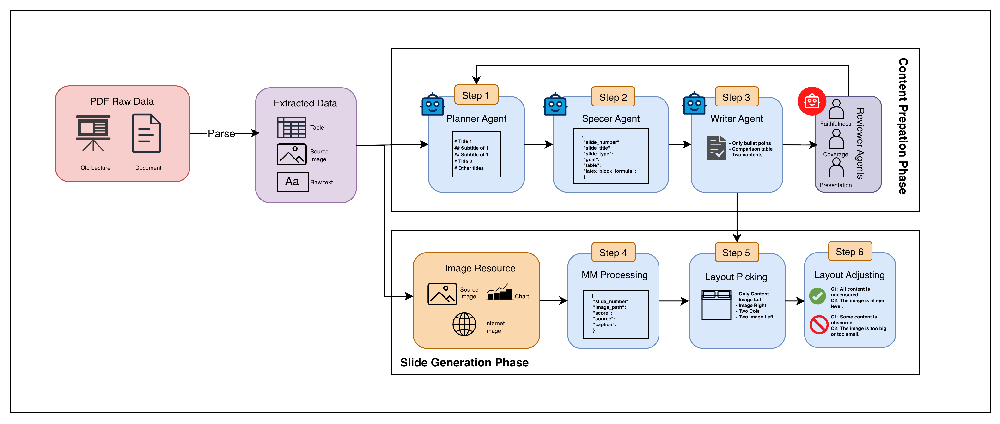

# LecSlideGen: Automated Lecture Generation Pipeline

LecSlideGen is an automated experimental pipeline designed to convert raw academic documents into structured, presentation-ready Slidev decks. The system utilizes a parallel Multi-Agent LLM architecture with built-in reflection and refinement mechanisms to ensure structural integrity and high content faithfulness to the source material.

## System Overview

<p align="center">
  
  <br>
  <i>Figure 1: End-to-end framework architecture</i>
</p>

## Architecture Highlights
- Multi-Agent Workflow: Modular agents handling document planning, slide specification, drafting, peer-reviewing, and active refinement.
- Self-Correction Mechanism: Parallel reviewers and a backtracking system to eliminate content hallucination and formatting failures.
- Pedagogical Layouts: Outputs directly to Slidev, focusing on standard educational presentation rules.


## Setup
Ensure all dependencies are installed, then create your local environment configuration by copying the provided example file:

```bash
cp .env.example .env
```
After copying, update the `.env` file with your specific API keys and model configurations.

## Usage

### 1. Automated Batch Processing
Generate slides for all supported documents placed inside the `data/raw/` directory.
```bash
python -m main --limit 10
```

### 2. Single Document Processing
Convert a specific document into slides, allowing customized overriding of the title and presenter metadata.
```bash
python -m main \
    --document_path "data/raw/document.pdf" \
    --lecture_title "Customized Lecture Title" \
    --speaker_information "John Doe"
```

### 3. Modular Debugging
For analytical purposes or manual intervention, the pipeline can be executed chronologically:
```bash
# Phase 1: Extract textual and tabular context
python -m src.extractor.extract_file --input "data/raw/document.pdf"

# Phase 2: Preprocess context
python -m src.preprocessor.preprocessing_context --context "data/context/doc_id.json"

# Phase 3: Process multimodal assets
python -m src.multimodal.multimodal_processing --lecture "data/lectures/file_name.json"

# Phase 4: Generate slides through the Multi-Agent framework
python -m src.generator.slide_gen --lecture "data/lectures/file_name.json"
```

## Empirical Performance Evaluation

The system was evaluated utilizing the PPTEval framework (LLM-as-a-Judge architecture) to measure cognitive load distribution, pedagogical adherence, text faithfulness, and generation robustness. The baseline results compare the LecSlideGen parallel multi-agent approach against existing linear-generation solutions (DocPres, KCTV).

### Table 1: Quality and Faithfulness Metrics
| System Architecture | Model Engine | ROUGE-L | Content | Design | Coherence |
| :--- | :--- | :---: | :---: | :---: | :---: |
| DocPres (Baseline) | Qwen3.5-9B | 11.35 | 2.82 | 2.86 | 3.08 |
| KCTV (Baseline) | Qwen3.5-9B | 8.95 | 2.74 | 3.21 | 3.32 |
| **LecSlideGen** (Ours) | **Qwen3.5-9B** | **22.32** | 3.22 | 3.92 | **3.33** |
| **LecSlideGen** (Ours) | **GPT-4.1-mini** | 19.41 | **3.25** | **4.08** | 3.10 |

### Table 2: Robustness and Computational Cost
| System Architecture | Model Engine | Success Rate | Failed Gen | Avg Calls | Token/Output (k) | Done Time (m) |
| :--- | :--- | :---: | :---: | :---: | :---: | :---: |
| DocPres (Baseline) | Qwen3.5-9B | ~69% | 15 | ~13.0 | 23.7 | 2.50 |
| KCTV (Baseline) | Qwen3.5-9B | ~81% | 9 | ~5.0 | 9.3 | 1.30 |
| **LecSlideGen** (Ours) | **Qwen3.5-9B** | **100%** | **0** | 16.4 | 51.1 | 1.37 |
| **LecSlideGen** (Ours) | **GPT-4.1-mini** | **100%** | **0** | 16.6 | 42.3 | **0.85** |

### Evaluation Considerations
The integration of a parallel Reflection layer results in an absolute `100% Success Rate` and significantly enhances layout quality (`Design Score: 4.08`). This mitigates the critical structural failure modes observed in existing frameworks. The compute overhead (API calls and average tokens) represents an acceptable operational trade-off given the elimination of invalid format outputs and near-doubled text adherence (`ROUGE-L`).

## Benchmarking Execution
To reproduce the benchmarking results in your local setup:
```bash
# 1. Run the entire generation and evaluation suite
python run_benchmark.py

# 2. Summarize runtime and quality metrics (automatically filters by model)
python summarize_performance.py --log logs/llm_calls_gpt-4.1-mini.jsonl
```
