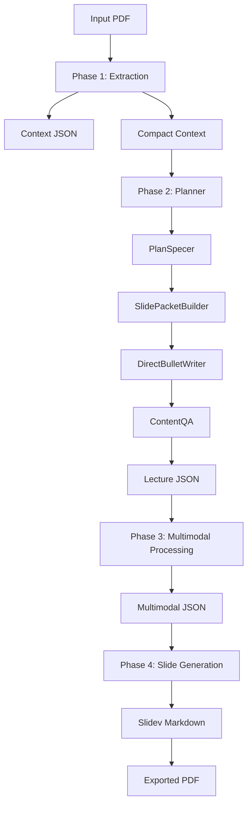

# Báo Cáo Pipeline Hiện Tại Của LecSlideGen

## 1. Mục Tiêu Refactor

Pipeline ban đầu của LecSlideGen đi theo hướng nhiều agent LLM nối tiếp nhau:

```text
Planner
-> PlanSpecer
-> Writer
-> Reviewer
-> Formatter
-> Content QA
```

Cách làm này chạy được với một số tài liệu đơn giản, nhưng khi thử trên nhiều PDF khác nhau thì lộ ra nhiều vấn đề:

- Các phase sau vẫn phải nhìn lại context lớn từ PDF, gây tốn token.
- Writer sinh paragraph trước, sau đó Formatter lại phải biến paragraph thành bullet.
- Formatter có thể làm mất hoặc làm sai facts quan trọng.
- Reviewer dùng LLM tốn call nhưng vẫn bỏ sót lỗi cụ thể như số liệu, công thức, placeholder.
- Vector DB / RAG đôi khi lấy chunk gần nghĩa nhưng sai phạm vi slide.
- Content QA nằm quá muộn, lúc lỗi đã đi qua nhiều tầng biến đổi.

Sau refactor, pipeline chuyển sang tư duy mới:

```text
Extract once
-> Structure once
-> Build source-grounded slide packets
-> Generate final bullets directly
-> Validate by deterministic contracts
-> Render
```

Ý tưởng chính là: Phase 1 được phép tốn chi phí vì nó đọc và hiểu PDF gốc. Nhưng các phase sau không nên đọc lại full document. Thay vào đó, chúng dùng compact context và slide packet nhỏ, có cấu trúc, bám nguồn rõ ràng.

---

## 2. Tổng Quan Pipeline

Pipeline hiện tại gồm 4 phase chính:

```text
Phase 1: PDF Extraction
Phase 2: Lecture Content Generation
Phase 3: Multimodal Processing
Phase 4: Slide Generation and Export
```

Luồng tổng quát:



Thay đổi kiến trúc quan trọng:

```text
Vector DB / FAISS / RAG đã được loại khỏi content pipeline.
```

Pipeline hiện tại không build và không load FAISS vector store cho quá trình sinh nội dung slide. Thay vào đó, evidence được lấy từ compact context, page cards, lexical ranking và structured fact extraction.

---

## 3. Phase 1: PDF Extraction

File chính:

```text
src/extractor/extract_file.py
```

Input:

```text
data/raw/<document_id>.pdf
```

Output chính:

```text
data/context/<document_id>.json
data/context/<document_id>_compact.json
```

### 3.1 Context JSON

`context JSON` là biểu diễn chi tiết của tài liệu sau khi extract.

Nó chứa:

- `document_id`
- tên file gốc
- markdown text theo trang
- số trang
- metadata
- ảnh đã extract
- bảng nếu có
- asset references

Đây vẫn là representation nội bộ gần nhất với PDF gốc.

### 3.2 Compact Context

`compact context` là bản rút gọn có cấu trúc, dùng cho các phase sau để giảm token.

Ví dụ schema:

```json
{
  "schema_version": 2,
  "document_id": "...",
  "source_file": "...",
  "page_count": 0,
  "document_summary": "...",
  "section_map": [],
  "page_cards": [],
  "asset_manifest": []
}
```

Mỗi `page_card` có thể gồm:

```json
{
  "page": 1,
  "headings": [],
  "summary": "...",
  "keywords": [],
  "assets": [],
  "numbered_items": [],
  "formula_count": 0,
  "table_count": 0
}
```

Trường `numbered_items` được thêm sau khi benchmark PDF ECSA. Đây là loại PDF có nội dung chính là danh sách đánh số, ví dụ 10 nguyên tắc, quy tắc, bước làm, khuyến nghị hoặc guidelines.

Ví dụ:

```json
{
  "number": 7,
  "text": "The data and metadata from Citizen Science projects are made publicly accessible..."
}
```

Nếu không có `numbered_items`, pipeline rất dễ sinh bullet rác như:

```text
8
9
10
Berlin, den 6
```

---

## 4. Phase 2: Lecture Content Generation

File chính:

```text
src/preprocessor/preprocessing_context.py
src/workflow/graph.py
```

Luồng LangGraph hiện tại:

```text
Planner
-> PlanSpecer
-> SlidePacketBuilder
-> DirectBulletWriter
-> ContentQA
```

Luồng cũ đã bị bỏ khỏi active path:

```text
Writer paragraph
-> Reviewer
-> Formatter
```

Lý do bỏ luồng cũ:

- sinh paragraph rồi format thành bullet là một bước trung gian không cần thiết;
- mỗi lần biến đổi text là một lần có nguy cơ mất facts;
- reviewer LLM tốn call nhưng không đủ chắc để bắt lỗi exact number/formula;
- formatter đôi khi làm slide đẹp hơn nhưng nội dung lệch đi.

Pipeline mới sinh bullet cuối trực tiếp từ slide packet.

---

## 5. Planner

File:

```text
src/workflow/agents/planner.py
```

Planner đọc compact context và tạo outline bài giảng.

Ví dụ output:

```markdown
# Introduction to Linear Programming
## Definition and Real-World Use
## Steps for Developing an LP Model

# Developing the Product Mix Model
## Objective Function Formulation
## Defining Constraints for Production
```

Planner chịu trách nhiệm về cấu trúc dạy học tổng thể:

- bài nên có những section nào;
- số heading khoảng bao nhiêu;
- thứ tự trình bày có hợp lý không;
- nội dung đi từ khái niệm đến ví dụ, kết quả, diễn giải.

Planner không viết nội dung slide cuối.

---

## 6. PlanSpecer

File:

```text
src/workflow/agents/plan_specer.py
```

PlanSpecer biến outline thành slide specs.

Ví dụ một slide spec:

```json
{
  "slide_number": 5,
  "slide_title": "2.1 Product Mix Problem Formulation",
  "slide_type": "content",
  "goal": "Explain the model formulation using objective and constraints.",
  "table": null,
  "latex_block_formula": null
}
```

PlanSpecer hiện dùng compact context và structured page evidence. Nó không dùng Vector DB hoặc RAG.

Nếu LLM trả thiếu heading hoặc JSON không đủ slide, PlanSpecer có logic repair/fallback để fill missing specs.

---

## 7. SlidePacketBuilder

File:

```text
src/workflow/agents/slide_packet_builder.py
```

Đây là phần quan trọng nhất của pipeline mới.

SlidePacketBuilder biến mỗi slide spec thành một `slide packet` bám nguồn.

Ví dụ packet:

```json
{
  "slide_number": 5,
  "slide_title": "2.1 Product Mix Problem Formulation",
  "intent": "model_formulation",
  "source_pages": [3, 2],
  "required_facts": [
    "Objective formula: Z = 13x_1 + 11x_2",
    "Constraint: 4x_1 + 5x_2 <= 1500",
    "Constraint: 5x_1 + 3x_2 <= 1575"
  ],
  "required_checks": [
    {
      "kind": "objective_formula",
      "formula": "Z = 13x_1 + 11x_2"
    },
    {
      "kind": "constraints",
      "items": [
        "4x_1 + 5x_2 <= 1500",
        "5x_1 + 3x_2 <= 1575"
      ]
    }
  ],
  "evidence": "short source evidence..."
}
```

Packet là intermediate representation quan trọng nhất của pipeline.

Nó đóng vai trò như một hợp đồng nội dung:

```text
Slide này được phép dùng evidence nào?
Slide này bắt buộc phải giữ facts nào?
QA cần kiểm những facts nào?
```

Sau khi đã có packet, các agent phía sau không cần đọc lại full PDF.

---

## 8. Intent Layer

Mỗi slide packet có trường `intent`.

Các intent hiện tại:

```text
concept_intro
model_formulation
objective_formula
constraints
visual_method
result_interpretation
slack_interpretation
procedure
generic
```

`intent` quyết định loại facts nào bắt buộc phải giữ.

Ví dụ:

```text
objective_formula
-> phải giữ objective formula

constraints
-> phải giữ inequalities hoặc resource constraints

result_interpretation
-> phải giữ result values

slack_interpretation
-> phải giữ slack amount và ý nghĩa slack

procedure
-> phải giữ workflow actions

visual_method
-> không ép phải có exact result values nếu slide chỉ nói phương pháp đồ thị
```

Việc này giúp giảm overfit theo từng PDF. Thay vì hardcode "slide LP phải có 4335", pipeline dùng rule tổng quát hơn:

```text
Nếu slide có intent result_interpretation
và source evidence có result values,
thì slide phải giữ những result values đó.
```

---

## 9. Structured Fact Extraction

SlidePacketBuilder không chỉ lấy sentence generic. Nó có các extractor cho nhiều dạng facts.

### 9.1 Formula Facts

Dùng cho PDF toán, kỹ thuật, STEM.

Ví dụ:

```text
Z = 13x_1 + 11x_2
```

### 9.2 Constraint Facts

Ví dụ:

```text
4x_1 + 5x_2 <= 1500
5x_1 + 3x_2 <= 1575
```

### 9.3 Result Facts

Ví dụ:

```text
X1 = 270
X2 = 75
maximum income = 4335
```

### 9.4 Slack Facts

Ví dụ:

```text
45 ft^2 storage space is unused
```

Extractor tránh coi số trong phép tính là slack values.

Output sai trước đây:

```text
Slack values include 45 ft^2, 1500, 4, and 270
```

Output đúng:

```text
Slack value: 45 ft^2
```

### 9.5 Workflow Facts

Dùng cho slide hướng dẫn thao tác hoặc phần mềm.

Ví dụ:

```text
Double click the proLP icon
Click entry data
Click solve
Click save
```

### 9.6 Numbered List Facts

Dùng cho PDF dạng principles, rules, recommendations, steps, guidelines.

Ví dụ từ ECSA:

```text
Principle 7: Data and metadata are publicly accessible.
Principle 8: Contributors receive acknowledgment and recognition.
Principle 9: Evaluation is based on scientific results, data quality, participant value, and societal impact.
Principle 10: Projects consider legal and ethical aspects.
```

Phần này được thêm sau khi generic sentence extraction thất bại với ECSA.

---

## 10. DirectBulletWriter

File:

```text
src/workflow/agents/direct_bullet_writer.py
```

DirectBulletWriter nhận slide packets và sinh bullet cuối trực tiếp.

Input:

```json
{
  "slide_title": "...",
  "intent": "...",
  "required_facts": [],
  "required_checks": [],
  "evidence": "..."
}
```

Output:

```json
{
  "slide_number": 5,
  "content": [
    "Objective formula: $Z = 13x_1 + 11x_2$",
    "Storage constraint: $4x_1 + 5x_2 \\le 1500$",
    "Raw material constraint: $5x_1 + 3x_2 \\le 1575$"
  ]
}
```

Writer được yêu cầu:

- chỉ dùng facts từ packet evidence;
- giữ required facts;
- không tự thêm số liệu ngoài source;
- không copy page headers, image captions, markdown artifacts;
- viết bullet ngắn, rõ, dùng được trên slide.

Điểm khác biệt lớn: không còn viết paragraph trung gian rồi gọi formatter nữa.

---

## 11. ContentQA

File:

```text
src/workflow/agents/content_quality.py
```

ContentQA kiểm bullet sau khi writer sinh xong.

Nó kiểm theo packet contract:

- thiếu objective formula bắt buộc;
- thiếu constraints;
- thiếu result values;
- thiếu slack value hoặc slack interpretation;
- thiếu workflow actions;
- content rỗng;
- ít hơn 3 bullet usable;
- placeholder;
- markdown heading bị copy vào bullet;
- image caption bị copy vào bullet;
- bullet chỉ là số như `8`, `9`, `10`;
- lỗi inline math như `$4335.` thiếu đóng `$`;
- slack values bị nhiễu như `45 ft^2, 1500, 4, 270`.

Ví dụ bad bullets bị chặn:

```text
8
9
10
Berlin, den 6
Source-backed details required
Slack values include 45 ft^2, 1500, 4, and 270
This production level yields $4335.
```

ContentQA có hai cách repair:

1. deterministic fallback từ packet checks;
2. LLM repair nếu deterministic fallback không đủ.

Nguyên tắc quan trọng:

```text
Hard failure dựa trên packet required_checks.
Title mismatch heuristic chỉ là soft warning.
```

Điều này giảm overfit theo một PDF hoặc một title cụ thể.

---

## 12. Phase 3: Multimodal Processing

File:

```text
src/multimodal/multimodal_processing.py
```

Input:

```text
data/lectures/<document_id>/<document_id>.json
```

Output:

```text
data/lectures/<document_id>/<document_id>_multimodal.json
data/lectures/<document_id>/<document_id>_image_distribution.json
data/lectures/<document_id>/<document_id>_table_distribution.json
```

Nhiệm vụ:

- gom ảnh và bảng đã extract từ PDF;
- gắn ảnh/bảng vào slide phù hợp;
- lưu metadata phân phối media.

Content pipeline không còn dùng Vector DB. Tuy nhiên, multimodal image matching vẫn có thể dùng embedding similarity vì đây là bài toán match ảnh, không phải textual RAG.

---

## 13. Phase 4: Slide Generation And Export

File:

```text
src/generator/slide_gen.py
```

Input:

```text
data/lectures/<document_id>/<document_id>_multimodal.json
```

Output:

```text
src/generator/slidev/<document_id>.md
output/<document_id>/<model_name>/<document_id>-export.pdf
output/<document_id>/<model_name>/<document_id>.json
output/<document_id>/<model_name>/slide_images/
```

Phase này:

- chọn theme;
- chọn layout;
- chèn ảnh/bảng;
- viết Slidev markdown;
- export PDF;
- package output cuối.

---

## 14. Logging Và Benchmark

File:

```text
src/utils/llm.py
main.py
```

Mỗi lần chạy pipeline có một `run_id`.

Các file log:

```text
logs/llm_calls_<model>.jsonl
logs/llm_run_<run_id>.json
logs/llm_runs.jsonl
```

Một run summary có dạng:

```json
{
  "total_calls": 23,
  "prompt_tokens": 32637,
  "completion_tokens": 3778,
  "total_tokens": 36415,
  "avg_total_tokens_per_call": 1583.26,
  "missing_usage_calls": 0,
  "by_phase": {
    "preprocess_context": {},
    "multimodal": {},
    "slidegen": {}
  },
  "by_model": {},
  "by_api_type": {}
}
```

Các metric có thể dùng khi benchmark:

```text
calls per PDF
tokens per PDF
tokens per slide
calls per slide
tokens per phase
repair calls per PDF
```

Ví dụ:

```text
14-Math-1:
23 calls
36,415 tokens
14 slides

ECSA:
9 calls
10,441 tokens
6 slides
```

Kết luận từ benchmark ban đầu:

```text
Call count và token count không cố định.
Chúng phụ thuộc vào số trang, số slide, số ảnh, số retry và số repair.
```

---

## 15. So Sánh Pipeline Cũ Và Pipeline Mới

Pipeline cũ:

```text
PDF
-> context
-> vector store
-> Planner
-> PlanSpecer
-> Writer paragraph
-> Reviewer
-> Formatter
-> ContentQA
-> multimodal
-> slidegen
```

Vấn đề:

- tốn token do reuse context lớn;
- vector retrieval có thể lấy nhầm chunk;
- paragraph writer và formatter có thể làm sai facts;
- reviewer tốn call nhưng không đủ strict;
- QA phát hiện lỗi muộn.

Pipeline mới:

```text
PDF
-> context JSON
-> compact structured context
-> Planner
-> PlanSpecer
-> SlidePacketBuilder
-> DirectBulletWriter
-> ContentQA
-> multimodal
-> slidegen
```

Lợi ích:

- bỏ Vector DB / FAISS / textual RAG;
- ít tầng biến đổi LLM hơn;
- mỗi slide có source-grounded packet;
- QA kiểm deterministic bằng packet contract;
- hỗ trợ nhiều loại PDF hơn;
- có logging call/token rõ ràng.

---

## 16. Những Dạng PDF Pipeline Hiện Hỗ Trợ Tốt Hơn

Pipeline mới xử lý tốt hơn các pattern sau:

- công thức toán;
- constraints / inequalities;
- numerical results;
- slack / unused resource;
- workflow phần mềm;
- numbered principles / guidelines;
- ảnh và bảng gắn sau content generation.

Ví dụ:

```text
14-Math-1
-> objective, constraints, optimal values, slack

ECSA
-> numbered principles 1..10
```

---

## 17. Hạn Chế Hiện Tại

Pipeline hiện tại đã ổn hơn, nhưng chưa hoàn hảo.

Các hạn chế còn lại:

- intent classification vẫn là deterministic, có thể sai với title lạ;
- numbered-list extraction cần test thêm nhiều format khác;
- fallback bullet đôi khi còn hơi máy móc;
- multimodal image matching vẫn có thể gắn ảnh chưa thật sát;
- cần benchmark thêm nhiều family PDF.

Các nhóm PDF nên benchmark tiếp:

```text
STEM lecture notes
research papers
policy documents
numbered principles/guidelines
software tutorials
slide-like PDFs
scanned/image-heavy PDFs
table-heavy reports
```

---

## 18. Kết Luận

Pipeline mới chuyển LecSlideGen từ một chuỗi agent LLM tự do sang một pipeline có intermediate representation rõ ràng.

Trung tâm của kiến trúc mới là `slide packet`:

```text
slide spec
-> slide packet
-> final bullets
-> contract QA
```

Điều này giúp hệ thống dễ kiểm soát hơn:

- facts được extract trước khi viết;
- mỗi slide có evidence riêng;
- required facts được khai báo rõ;
- QA kiểm theo contract;
- token và call được log theo từng run.

Nói ngắn gọn, pipeline mới giống một:

```text
document compiler
```

hơn là một:

```text
LLM agent chain
```

Đó là lý do pipeline mới dễ debug hơn, dễ benchmark hơn, và có khả năng mở rộng tốt hơn cho nhiều loại PDF.
